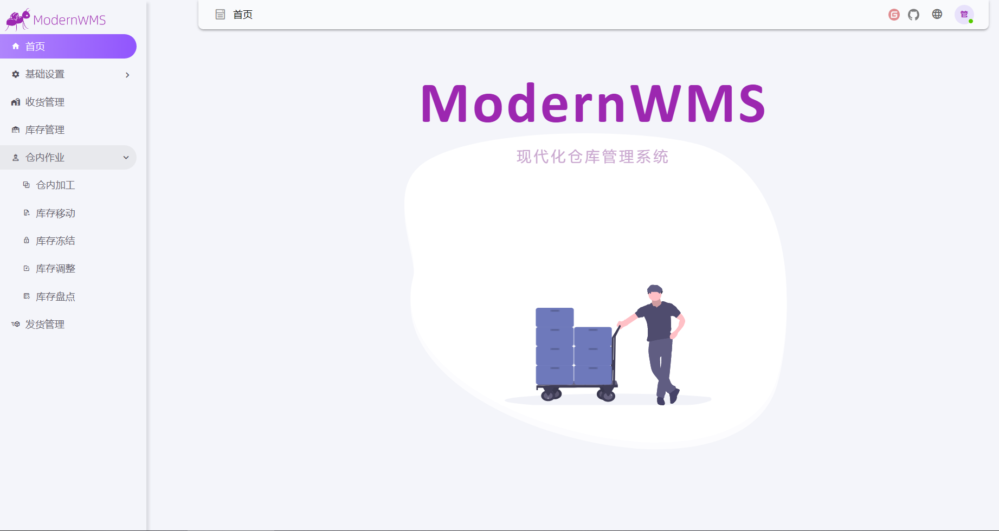
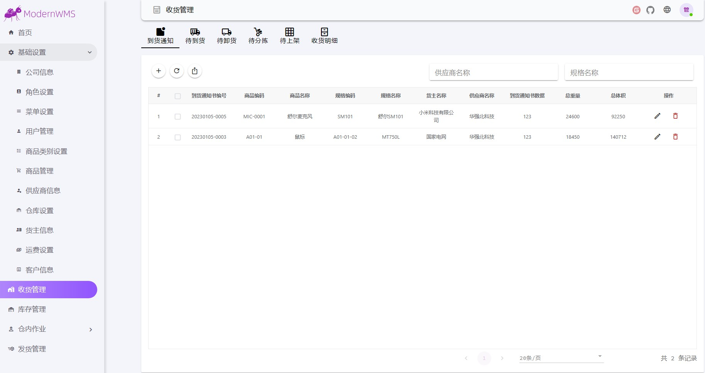
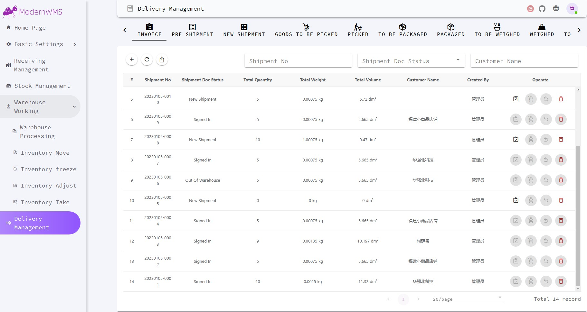

# ModernWMS - 仓库管理系统 

<div align="center">
  
  <h1>ModernWMS</h1>
  <p>开源的简易完整的仓库管理系统</p>

<!-- Badges -->
[](https://opensource.org/license/apache-2-0/)


[](https://www.mysql.com/downloads/)
[](https://www.mysql.com/downloads/)
[](https://www.mysql.com/downloads/)


<!-- -->


</div>
<div align="center">
  <h3>
  <a href="https://gitee.com/modernwms/ModernWMS/blob/master/README.md">English Document</a>
  </h3>
  <h3>
  <a href="https://modernwms.ikeyly.com">官网首页</a>
  </h3>
</div>

# 目录 

- [ModernWMS - 仓库管理系统](#modernwms---仓库管理系统)
- [目录](#目录)
  - [介绍](#介绍)
  - [必要条件](#必要条件)
    - [Linux OS](#linux-os)
    - [Windows OS](#windows-os)
  - [安装](#安装)
    - [Linux](#linux)
    - [Windows](#windows)
  - [使用方法](#使用方法)
  - [联系我们](#联系我们)
  - [版权信息](#版权信息)
  - [特别声明](#特别声明)
  - [捐赠](#捐赠)


## 介绍
  该库存管理系统是，我们从多年ERP系统研发中总结出来的一套针对小型物流仓储供应链流程。 在工作过程中我们很多的中小企业，由于IT预算有限，所以无法用上适合他们的系统，却又实实在在存在仓储管理方面的需求，以此我们开始了这个项目。 为了帮助一些有需要的用户。

## 必要条件

### Linux OS

+ Ubuntu 18.04(LTS),20.04(LTS),22.04(LTS)
+ CentOS Stream 8,9
+ RHEL 8(8.7),9(9.1)
+ Debian 10,11
+ openSUSE 15

### Windows OS

+ Windows 10 版本 1607 或更高版本
+ Windows Server 2012 或更高版本

## 安装

### Linux

+ 下载源码后编译
  + 第一步，下载源码

  ```bash
  cd /tmp/ && wget https://gitee.com/modernwms/ModernWMS/repository/archive/master.zip
  ```  

  + 第二步，安装.NET SDK 和 NodeJS

  ```bash
  wget https://packages.microsoft.com/config/ubuntu/20.04/packages-microsoft-prod.deb -O packages-microsoft-prod.deb
  sudo dpkg -i packages-microsoft-prod.deb
  sudo apt-get update && sudo apt-get install -y dotnet-sdk-7.0
  curl -fsSL https://deb.nodesource.com/setup_16.x | sudo -E bash -
  sudo apt install -y nodejs
  sudo apt-get install gcc g++ make
  sudo npm install -g yarn
  ```  

  + 第三步，编译前端和后端

  ```bash
  sudo apt install unzip
  cd /tmp/ && unzip master.zip && cd ./ModernWMS-master
  mkdir -p /ModernWMS/frontend/ /ModernWMS/backend/
  cd /tmp/ModernWMS-master/frontend/ 
  sed -i 's#http://127.0.0.1#http://前部署服务器的IP地址#g' ./.env.production
  yarn && yarn build && cp -rf /tmp/ModernWMS-master/frontend/dist/* /ModernWMS/frontend/
  cd /tmp/ModernWMS-master/backend/ && sudo dotnet publish && cp -rf /tmp/ModernWMS-master/backend/ModernWMS/bin/Debug/net7.0/publish/* /ModernWMS/backend/
  cp -rf /tmp/ModernWMS-master/backend/ModernWMS/wms.db /ModernWMS/backend/
  ```  

  + 第四步，安装nginx

  ```bash
  cd /tmp/ && wget http://nginx.org/download/nginx-1.18.0.tar.gz 
  tar -zxvf nginx-1.18.0.tar.gz && cd nginx-1.18.0
  ./configure --prefix=/etc/nginx --with-http_secure_link_module --with-http_stub_status_module --with-http_realip_module --without-http_rewrite_module --without-http_gzip_module
  make && make install
  cp -rf /ModernWMS/frontend/* /etc/nginx/html/
  nohup /etc/nginx/sbin/nginx -g 'daemon off;' &
  cd /ModernWMS/backend/ && dotnet ModernWMS.dll --urls http://0.0.0.0:20011
  ```  
### Windows

+ 下载源码后编译部署
  + 第一步，下载源码
  ```PowerShell
  cd C:\
  wget -Uri https://gitee.com/modernwms/ModernWMS/repository/archive/master.zip  -OutFile master.zip
  Expand-Archive -Path C:\master.zip -DestinationPath C:\
  ```
  + 第二步，安装.NET SDK 和 NodeJS
  ```CMD
  wget -Uri https://download.visualstudio.microsoft.com/download/pr/35660869-0942-4c5d-8692-6e0d4040137a/4921a36b578d8358dac4c27598519832/dotnet-sdk-7.0.101-win-x64.exe  -OutFile dotnet-sdk-7.0.101-win-x64.exe
  .\dotnet-sdk-7.0.101-win-x64.exe /install /quiet /norestart
  wget -Uri https://nodejs.org/dist/v16.13.1/node-v16.13.1-x64.msi  -OutFile node-v16.13.1-x64.msi
  msiexec /i .\node-v16.13.1-x64.msi /passive /norestart
  npm install -g yarn
  ```
  + 第三步，编译前端和后端
  ```
  md C:\ModernWMS\frontend\
  md C:\ModernWMS\backend\
  cd C:\ModernWMS-master\backend
  dotnet publish 
  copy-item -path "C:\ModernWMS-master\backend\ModernWMS\bin\Debug\net7.0\publish\*" -destination "C:\ModernWMS\backend\" -recurse
  copy-Item "C:\ModernWMS-master\backend\ModernWMS\wms.db" -Destination "C:\ModernWMS\backend\"
  cd C:\ModernWMS-master\frontend  
  yarn
  yarn build 
  copy-item -path "C:\ModernWMS-master\frontend\dist\*" -destination "C:\ModernWMS\frontend\" -recurse
  ```
  + 第四步，安装nginx并启动
  ```
  cd C:\
  wget -Uri http://nginx.org/download/nginx-1.16.1.zip -OutFile nginx-1.16.1.zip
  Expand-Archive -Path C:\nginx-1.16.1.zip -DestinationPath C:\
  copy-item -path "C:\ModernWMS\frontend\*" -destination "C:\nginx-1.16.1\html\" -recurse
  cd C:\nginx-1.16.1\
  start nginx.exe
  cd C:\ModernWMS\backend\
  dotnet ModernWMS.dll --urls http://0.0.0.0:20011
  ```

## 使用方法

  ```shell
  打开浏览器，进入：http://127.0.0.1 或者http://部署电脑的IP地址  
  
  初始账号: admin 密码: 1
  ```
  <h4>
    <a href="https://wmsonline.ikeyly.com">体验地址入口</a>
  </h4> 

  

  
  
  

## 联系我们

<h4>
  <a href="https://gitee.com/leucoon/vue-element-plus-admin/issues/new?issue%5Bassignee_id%5D=0&issue%5Bmilestone_id%5D=0">提交一个Bug</a>
</h4>
<h4>
  <a href="https://gitee.com/leucoon/vue-element-plus-admin/issues/new?issue%5Bassignee_id%5D=0&issue%5Bmilestone_id%5D=0">提交一个建议</a>
</h4>

## 版权信息
该项目使用的是 [Apache2.0](https://opensource.org/license/apache-2-0/) 协议. 详情查阅[LICENSE.txt](https://gitee.com/modernwms/ModernWMS/blob/master/LICENSE).必须遵守此协议。

## 特别声明

本项目已加入 [dotNET China](https://gitee.com/dotnetchina)  组织。<br/>


## 捐赠

如果您觉得我的开源库可以帮到您，请我们的作者喝杯咖啡吧，您的支持将鼓励我们继续创作。


